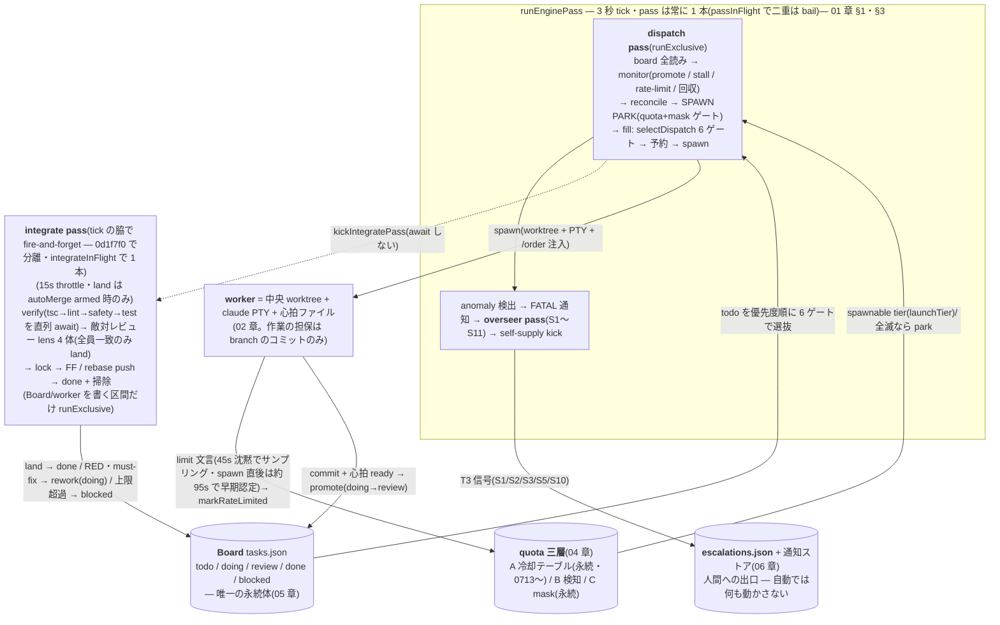

# 00 — INDEX: 司令塔文書の入口(読む順・メンタルモデル・十戒・表示の信頼度)

**対象コミット: `0d1f7f0`**(origin/main tip、2026-07-10)。章ごとの行番号基準が**2 つ**ある:
**03/06 章と TARGET-STATE は `0d1f7f0`** — 同日 main 入りの根治 3 件(`3129a58` = レビューの diff 連動 budget + 棄権理由、`d8431c3`+`aa9cb8d` = S3/S10 再投函根絶、`0d1f7f0` = quota 検知 21 分遅延の根治)を反映・リナンバー済み。
**01/02/04/05 章は `cc7c60e` のまま** — 根治 3 件が `swarmOrchestrator.ts`(6349→6730 行、:355 以降が +38〜+381 シフト)/ `swarmOverseer.ts` / `swarmEscalations.ts`(:250 以降 +36)/ `types.ts`(:1147 以降 +7)を変えたため、これらのファイルへの行番号参照はずれている可能性がある(:354 以前の orchestrator 参照と、terminal.ts 等それ以外のファイル参照は有効)。**01 章 TL;DR#3・§6(monitor 飢餓)と 04 章 §3.2/3.3/3.6(検知 3 因子)は `0d1f7f0` で機構ごと過去の姿になった** — 両章に部分注記済み、現行の姿は 03 章 §2.1/§2.4 と TARGET-STATE §1。疑ったら現物優先(§6-1)。
**例外(2026-07-12・会話 resume)**: 05 章 §6.2 の `/api/swarm/*` 行番号と 04 章 §2.6 の manager/supply 行番号は、resume 実装時に**現物から実測し直して更新済み**(`server/routes/swarm.ts` は +17 シフトしていた)。05 章に **§10(会話 resume)** を追加。それ以外の 04/05 の参照は依然 `cc7c60e` 基準。
**読者**: 将来の司令塔(og-manage / manage セッション)。
**この文書の役割**: docs/commander/ 全 6 章 + TARGET-STATE の統合索引。個別の機構は各章が正典 — ここは「どこを読むか」「全体がどう噛み合うか」「何を信じ何を疑うか」「何をしてはいけないか」を 1 枚に持つ。

---

## 0. この文書群が存在する理由

司令塔セッションが OG swarm の全体構造を誤読し、同じ失敗を繰り返した:

- **0707**: 短縮 id の Board 書き込みが 200 の中で黙殺 no-op → worker の虚偽報告を信じて誤診 2 連(05 章 §7-1)
- **0710**: workers API の `heartbeatAt`(凍結値)を信じて「worker が半日死んでいる」と誤診 — ディスクの心拍は生きていた(02 章 §4。**0711 でこの凍結自体を根治済み** — `heartbeatAt` はディスク優先に修正され、API の値を信じてよくなった)
- **0710**: 「rebase 済みだから安全」と思っていた worktree が worker 停止で消えた — 停止 = force 削除が仕様(02 章 §6)
- **0709**: 敵対レビューの「conflict」表示を rebase 競合と誤診 — 実体は大 diff による棄権凍結(03 章 §3・§4-1。凍結自体は `3129a58` で根治済み — 相乗り表示は現存)

対策がこの文書群。読み方の原則は 1 つ: **疑ったら必ず各章の検証コマンドで自分の目で裏取りする**。文書も古びる — 主張と現物が食い違ったら現物が正で、その時は文書を直す(§6)。

---

## 1. 読む順番と各章 1 行要約

| 順 | 章 | 1 行要約 |
|---|---|---|
| 1 | [01-engine-core](01-engine-core.md) | エンジン中枢 — 3 秒 tick の回り方・dispatch 6 ゲート・monitor 全分岐・in-memory 状態の寿命(再起動で全部消える)。※TL;DR#3/§6 の「integrate が monitor を飢餓させる」は `0d1f7f0` 以前の歴史 |
| 2 | [02-worker-lifecycle](02-worker-lifecycle.md) | worker の生涯 — spawn/心拍/promote/回収、worktree 削除の全 8 経路と**回収前の WIP 保全**、実行時間上限は**実作業時間**で測る(quota 待ちは控除 — 0712 の 47KB 全損を根治)、workers API `heartbeatAt` 凍結の解明と根治(0710 誤診の真因 → 0711 修正済み) |
| 3 | [03-integration-review](03-integration-review.md) | 統合パス 2 相(表示 A / land B)と敵対レビュー — verify、lens 4 体の全員一致、diff 連動 budget+棄権理由(`3129a58` 根治)と大 diff 凍結の実測(歴史)。tick 分離後の integrate の現行正典(§2.1/§2.4) |
| 4 | [04-quota-models](04-quota-models.md) | quota 五層 — 冷却テーブル(A、**再起動を生き延びる**・0713 永続化)/rate-limit 検知(B)/使用可能モデル mask(C)/使用状況キャッシュ pre-launch veto(D、`/usage` の既知の枯渇を起動前に見て梯子からトップ tier を篩う・2026-07-12。⛔ **ただし現行 CLI は per-model 行を出さないので fable 単独枯渇は層Dでは見えない** — 0713 実測、§5.7 冒頭)/**起動前プローブ(E、0713 — spawn 直前に未知 tier へ headless 1発叩いて CLI のクォータ拒否文字列を読む。fable 単独枯渇を起動前に検知できる唯一の層・壁は層Aに記録して梯子1段下げ・分からなければ fail-open。⚠ 健全 tier のプローブは実測 19〜73s なので launch は最大 8s しか待たず、プローブは detached 完走で次の launch から効く、§5.8)**。検知 21 分遅延の 3 因子と根治(`0d1f7f0` — 45 秒サンプリング+早期認定+limit 画面クロック)。**hold 中の時間は worker の実行時間から控除される**(§3.4-6 — 0712 根治)。真実は `launchTier` だけ |
| 5 | [05-board-api-contract](05-board-api-contract.md) | Board 契約 — tasks.json が唯一の永続体、列ライフサイクル、ロック/CAS、フル UUID の掟、二重 dispatch 両方向封鎖(cc7c60e)、**司令官/補給官の会話 resume(§10)** |
| 6 | [06-overseer-escalations](06-overseer-escalations.md) | overseer 信号 S1〜S11 と escalations/通知ストア — S3/S10 の 24h 窓+永続受領(`d8431c3`+`aa9cb8d` 根治)、再投函増殖の実測(歴史) |
| 7 | [TARGET-STATE](TARGET-STATE.md) | 理想の稼働形(北極星)— 観測可能な 6 条件・現状ギャップ・対応カード |

**症状からの入口**(全部読む時間がないとき):

| 症状 | 直行先 |
|---|---|
| worker が動かない / 消えた / 心拍が古く見える | 02 章(§4 heartbeatAt 凍結は 0711 根治済み、§6 worktree 削除の全経路) |
| **worker が実行時間上限で消え、未コミット作業が失われた** | 02 章 §5.5(runaway は**実作業時間**で判定 — quota 待ちは控除。0712 根治)+ §6(teardown 前に **WIP コミットで保全** — `git log <branch>` に `WIP: swarm reclaim auto-save`)+ §7-11(事故の全容)。quota 側の見方は 04 章 §3.4-6 |
| review 列から進まない / 'conflict' 表示 | 03 章(§2.2 conflict 相乗り、§3 大 diff 凍結、§5 手動統合) |
| dispatch されない / park している | 04 章(§5.5 spawnBlock、§7 運用手順)+ 01 章 §4.2 |
| カード操作が効かない / 列が勝手に戻る | 05 章(§6.3 id の掟、§7 落とし穴) |
| escalation が大量に来た / 古い障害が再通知される | 06 章(§4.1 S3 増殖、§5 トリアージ) |
| エンジンが「何もしていない」ように見える / 検知が遅い | 01 章 §7.6(log ring buffer)+ TARGET-STATE §1(検知の現行機構)。※01 章 §6 の monitor 飢餓は `0d1f7f0` で解消済み(歴史) |
| 全 claude セッションの Stop hook が MODULE_NOT_FOUND(worktree パスを指す) | 02 章 §2.5(hook source の cwd 非依存解決は 0712 根治済み — 応急処置は `installHooks` 再実行 = アプリ再起動 or POST /api/observer/install-hooks で正しいパスに上書き) |
| 司令官が**存在しない worker の話をする** / 前回の認識のまま喋る | §2.1 + 05 章 §10.2 — resume で会話は復元されるがエンジンの認知は消えている。「状況」で読み直させる |
| 司令官・補給官が**毎回記憶喪失**で立ち上がる(resume されない) | 05 章 §10.3 — fail-open の理由コード(`none`/`moved`/`live`/`missing`/`store`)。応答の `resumed` とサーバ log の `[swarmSessions]` 行で判別 |

---

## 2. 1 ページのメンタルモデル

中心は**エンジンの 3 秒 tick**(プロジェクトごとに 1 本、in-memory)。全機構はこの pass の中か、pass が読み書きする永続体(Board / branch / 心拍 / quota / escalations)のどちらかにいる。



**時間軸の罠(`0d1f7f0` で解消 — 歴史)**: かつては pass が dispatch → integrate を直列 await していたため、integrate 内の verify(最大 tsc 180s + test 600s)と敵対レビュー(カード直列・`3129a58` 後は最長 20 分/パネル)が pass を握っている間、**monitor は 1 回も回らなかった**(01 章 §6 に当時の機構、04 章 §4 に実測 21 分 30 秒)。現在は integrate が tick の脇で走る(03 章 §2.1)ので、**verify/panel がどれだけ遅くても monitor は 3 秒 tick で回り続ける** — 遅い integrate の実害は「review 列の決着が遅れる」ことに閉じる。

```
現在:   tick(3s): |-dispatch+monitor-|-dispatch+monitor-|-dispatch+monitor-|-…(常に数秒周期)
                        └ kick ──→ integrate(verify+panel で数分〜20分超、脇で1本だけ走る)
0d1f7f0 以前: |-dispatch+monitor-|-dispatch+monitor+integrate(数分〜10分超)————|-…
                                    ↑ この間の tick は全部 bail = 検知・promote がこの分だけ遅延(歴史)
```

**真実の在り処**(どのビューが権威か):

| 知りたいこと | 権威 | 経由 |
|---|---|---|
| カードと列 | `~/.openground/projects/<id>/tasks.json` | Board API(エンジンも loopback HTTP で同じ門 — 裏口なし。05 章 §1) |
| worker の作業内容 | **branch のコミット**(worktree は消耗品) | `git rev-list` / `git log`(02 章 §6) |
| worker の鮮度 | 心拍ファイルの `updatedAt`(ディスク) | `~/.openground/swarm/<repoキー>/*.json`(02 章 §3-4) |
| worker の生存 | PTY(terminal pool) | `GET /api/swarm/workers` の `terminalId` 有無(02 章 §3.3) |
| エンジンの認知 | `GET /api/swarm/orchestrator`(in-memory の写し — 再起動で全消え) | 01 章 §2 |
| 起動できる tier | `GET /api/swarm/quota` の **`launchTier`**(`tiers[]` は mask 盲目) | 04 章 §2.6 |
| 人間待ちの案件 | `~/.openground/escalations.json` の `status=open` | 06 章 §7.2 |
| 司令官/補給官の会話 | claude の transcript(id は `~/.openground/projects/<id>/swarm-sessions.json`)— **再起動を跨いで生き残る**(2026-07-12) | 05 章 §10 |

### 2.1 再起動で何が消え、何が生き残るか(resume した司令官は必ず読む)

2026-07-12 から司令官・補給官は `claude --resume` で**前回の会話を復元して**立ち上がる(05 章 §10)。
このとき**非対称性**を取り違えると、実在しない世界の話を続けることになる:

| | 再起動後 |
|---|---|
| 司令官・補給官の**会話履歴** | ✅ **生き残る**(resume) |
| エンジンの **in-memory 認知**(worker roster / reviews) | ❌ **全消え**。自動運転も必ず OFF に戻る(安全側) |
| **quota 冷却テーブル**(層A) | ✅ **生き残る**(2026-07-13 永続化 — `~/.openground/swarm-quota.json`。04 章 §2.1.1)。**「再起動後は冷却が空が正常」は旧知識** |
| Board / branch / 心拍 / escalations(**永続体**) | ✅ ディスクに在る = 唯一の足場 |
| **コード自体** | ⚠️ 変わっている可能性大 — 再起動はたいてい**リリース**。各章の file:line も疑う(§6) |

→ **だから resume 起動の司令官は、口を開く前に「状況」を頭から実行して Board 実体・worker 一覧・
エンジン状態を読み直す**(命令はスキル注入に埋め込み済み: `swarmManager.ts` `MANAGER_RESUME_INJECTION`)。
「前回こう言っていた」は根拠にならない — 現物(API/git)が正。これは戒 2「自己申告を信じず再検証」の
自分自身への適用でもある。

---

## 3. 司令塔の十戒(すべて実失敗から)

1. **フル UUID / フル id を使う。** 全 verb が `t.id === id` の完全一致(server/routes/project.ts:940)。短縮 id は results 有り verb で `unknown task id`、**results 無し verb(markDone / setPrUrl)は 200 のまま黙殺**(05 章 §8-1)。0707 の誤診 2 連の根。
2. **自己申告 ready を信じず再検証。** エンジンの promote すら `commitsAhead > 0` を必須にしている(swarmOrchestrator.ts:964-967)— 「done true」の心拍は宣言であって証明ではない。司令塔も同じ基準で `git rev-list --count origin/main..<branch>` を打つ(02 章 §5.2・§8)。
3. **`reviews[].status` の 'conflict' は 4 事象の相乗り表示。** 本物の rebase 競合 / verify RED / must-fix 差し戻し直後 / defer 凍結(needs-human)が全部 'conflict' に上書きされる(swarmOrchestrator.ts:5324-5325, 5396-5397, 5367, 5432。03 章 §2.2)。engine log の直前行で種別を確認してから動く。凍結だけは `reviews[].abstainSummary`(棄権内訳、`3129a58`)の有無で API 単体でも見分けられる。
4. **心拍鮮度は 0711 の修正後 workers API `heartbeatAt` を信じてよい。** 以前はエンジン worker の workers API `heartbeatAt` が「エンジンが最後に読んだ時刻」の凍結値で、0710 に「半日死んでいる」と誤診した(02 章 §4)。`hb?.updatedAt ?? w.heartbeatAt`(swarmWorkerRegistry.ts:188)への修正でディスク優先になった。`phase`/`note` は今回の修正対象外(引き続きエンジンの凍結値)なので、それらが必要なときはディスクの `updatedAt`/`.phase` で裏取りする。
5. **`branch -d` の前に local main を FF。** `branch -d` は現在の HEAD 側へのマージ済み判定なので、local main が origin/main に追従していないと統合済み branch でも "not fully merged" で失敗する(司令塔セッションで実測済みのツールギャップ)。先に `git fetch origin main` し、`git merge-base --is-ancestor <branch> origin/main` で統合済みを確認してから消す。
6. **掃除は merge-base 確認後のみ。** worker の「停止」は worktree force 削除とセット(02 章 §6 の全 8 経路)— 消す前に「コミットが branch / trunk に残るか」を確認する。janitor ですら `branch -d` のみ(`-D` は明示 force のみ)+ worker の消滅が証明できた心拍しか消さない(swarmJanitor.ts:219-231, :364-377)。**0712 根治後、エンジン経由の teardown(経路 2〜5)は消す前に未コミット分を WIP コミットに変換する**が、**`POST /api/swarm/worktree/remove` の force(経路 1)はその保全を通らない** — 手で消すときは今も自分で dirty を見る。
7. **guard の誤 block 3 パターンを知っておく**(実体は `~/.openground/guard/openground-guard.js`。PreToolUse hook、exit 2 で deny): ① push と `rm -f` が同居する 1-liner が force-push に誤検出される ② echo / コメント内の危険文字列が誤抽出される ③ `xargs git` は「stdin 供給のターゲットを検査できない」として一律 block(0710 実測: `git merge-base … | xargs git log` が blocked)。回避は「注釈を入れず 1 種類ずつ分割」「xargs でなく直接引数」。**guard の block は敵ではなく安全装置 — 回避のために guard を外さない。**
8. **緑テスト ≠ 正しさ。** `npm test` は型エラーを捕らない — 完了ゲートは `npx tsc --noEmit` / `npm test` / `npm run lint` の 3 点セット。テスト自体の効力も「コードを意図的に壊して赤くなるか」(変異テストの型)で初めて証明される — 実例: 循環判定の naive back-edge DFS はテスト green のまま cross edge を見逃した(SCC 必須と判明)。CI の flaky(負荷で timeout 発火がずれ pass/fail が反転)も「緑 = 正しい」を裏切る。
9. **エンジン稼働中に手動 dispatch しない — するなら `POST /api/swarm/worker {taskId}` 一択。** 同一 repo の dispatcher は常に 1 つ。手動 dispatch 前に `GET /api/swarm/orchestrator` で `running` を確認する(05 章 §7-2)。cc7c60e で両方向とも機械封鎖されたので taskId 経由は 409 で守られる — **409 は「先客あり」の正常動作**(05 章 §5.4)。`setColumn doing` + PTY 手組みは封鎖の外(やらない)。
10. **破壊操作の前に読み、書いたら読み戻す。** 書き込みは per-item `results` を確認し、さらに GET で読み戻す(05 章 §9-2)。削除は対象の現物(branch のコミット・worktree の dirty・心拍の鮮度・PTY の生死)を読んでから。「書けたはず」「もう要らないはず」が 0707 / 0710 の事故を作った。

---

## 4. 信じてよい表示・信じてはいけない表示

「信じるな」= 額面どおり受け取ると誤診する表示。必ず右列の一次情報で裏取りする。

| 表示 | 信頼度 | 理由と一次情報 |
|---|---|---|
| workers API `heartbeatAt`(**stage 付き** = エンジン worker) | ✅(0711 根治済み) | `hb?.updatedAt ?? w.heartbeatAt` — ディスク優先(swarmWorkerRegistry.ts:188)。ディスクに心拍が無い場合のみエンジンの凍結値にフォールバック |
| workers API `heartbeatAt`(stage 無し = エンジン外 worker) | ✅ | リクエスト毎にディスクを読む(swarmWorkerRegistry.ts:226, :246) |
| `GET /api/swarm/orchestrator` の `workers[].heartbeatAt`(roster 生値) | ❌ 信じるな | こちらは今回未修正 — エンジンが最後に monitor で読んだ凍結値のまま。鮮度確認は上の `/api/swarm/workers` かディスクの `updatedAt` を使う |
| workers API `ready` / `blocked` / `blockers` | ✅ | 全ソースでディスク心拍由来(swarmWorkerRegistry.ts:189-193, :227-231, :247-250) |
| 心拍ファイルの `updatedAt` | ✅ **唯一の真実** | worker(swarm-beat.sh)だけが書く。ただし内容(task 要約・ready)は自己申告 — 成果は戒 2 で裏取り |
| 心拍の `readyToMerge:true` | ⚠️ 宣言のみ | promote は `commitsAhead>0` が別途必須(swarmOrchestrator.ts:984-985)。差し戻し直後は古い ready が残る(:4433-4442 が抑制)— Board API/UI の外部差し戻しも 0713 からエンジンが観測して同じ抑制に乗る(02 章 §5.3) |
| `reviews[].status = 'conflict'` | ❌ 額面で信じるな | 4 事象の相乗り(戒 3)。→ engine log の直前行(03 章 §6-3)。`abstainSummary` が付いていれば defer 凍結(03 章 §2.6) |
| `reviews[].status = 'ff'` | ✅(その pass 時点) | 純 git 読み(swarmIntegrate.ts:188-215)。'rebase' は「競合するかは試すまで不明」の意 |
| `GET /api/swarm/quota` の `tiers[]` | ❌ 単独では信じるな | mask 盲目(04 章 §2.6)。「cooling:false = 使える」ではない |
| `GET /api/swarm/quota` の `launchTier` | ✅ | 唯一 mask+冷却の両方を通した値(server/routes/swarm.ts:129) |
| `GET /api/swarm/orchestrator` の `workers` 空 | ❌ 「worker 不在」と読むな | roster ∩ PTY 生存のみ(swarmOrchestrator.ts:1923)。再起動後のエンジン外 worker は `GET /api/swarm/workers` に出る(01 章 §7.3) |
| engine log(journal) | ⚠️ 「無い」を証明しない | 200 行 ring buffer(swarmOrchestrator.ts:201)+ 再起動で全消え。「journal に無い = 起きていない」ではない(01 章 §7.6) |
| journal に rate-limit 行が無い | ❌ 無実の証明にならない | `0d1f7f0` で根治 — spawn 直後の即死は約 1.5 分で検知(onset 窓)、稼働後の limit は実クロック化した 10 分ゲート(装飾再描画による無限先送りは根絶。TARGET-STATE §1・実測待ち)。加えて **journal 自体が 200 行 ring + 再起動で全消え**なので「無い」は今も無実を証明しない。疑ったら worker 画面と /usage を自分で見る |
| `manualStop` / `manualStopPersisted` | ✅ | 唯一 Settings に永続される engine 状態(swarmOrchestrator.ts:6155, :6239) |
| `autoMerge` / `selfSupply` / `overseer` の ON | ⚠️ 現プロセス限り | in-memory・再起動で必ず OFF(01 章 §7.4)。「前回 ON だったから今も ON」は成立しない |
| escalation の `branch` / `taskId` / スクリーンショット | ⚠️ 起票時点のスナップショット | 現在の実在は git / tasks.json で裏取り(06 章 §5.2 の 3 点セット) |
| S3(exec-timeout)escalation | ⚠️ 実発生として裏取り | `d8431c3`+`aa9cb8d` 以降は 24h 窓内の未受領 occurrence のみ上がる(06 章 §3.6 — 過去分の再投函は根絶済み。当時の実測 8 件→25 件増殖は §4.1 の歴史)。branch/カードの実在は 06 章 §5.2 で裏取り |
| カードの `reworkCount` | ⚠️ 全体像ではない | カウンタは 3 系統(API verb / engine in-memory / swarm-board.sh)で干渉しない(05 章 §2.4)。「エンジンが差し戻したのに 0」は正常 |
| 通知ストアに fatal が無い | ❌ 「起きていない」ではない | cap 50 の押し出しで消える(06 章 §4.4) |
| verb 書き込みの HTTP 200 | ⚠️ 成功の証明ではない | markDone / setPrUrl / add は per-item results 無しで黙殺があり得る(05 章 §8-1)。→ `results` 確認+読み戻し |
| 各章のカード列表記(「blocked 列」等) | ⚠️ 執筆時点のスナップショット | 列は動く(§6)。現在列は tasks.json で確認 |

---

## 5. 全章の検証コマンド集の目次

「主張を疑ったらここを打つ」の逆引き。コマンド本体は各章にある(そのままコピペ可能な形)。

| 章・節 | 何が裏取りできるか |
|---|---|
| [01 章](01-engine-core.md) **§9** | 対象コミットの鮮度 / エンジン状態(GET orchestrator)/ journal の scale・park・dispatch 行 / server-truth worker 一覧 / 心拍ディスク直読 / 定数の実値 / 二重 dispatch 封鎖の現物 / selectDispatch 6 ゲート / monitor 飢餓の観測(journal 時刻の空白) |
| [02 章](02-worker-lifecycle.md) **§8** | repo キー導出 / 全 worker のディスク心拍一覧 / workers API との突き合わせ(凍結の確認)/ worktree 実在確認 / promote 条件の手動再現(rev-list)/ dirty 判定 / 停止・削除・RESTART・手動 dispatch の実操作 |
| [03 章](03-integration-review.md) **§6** | reviews[] と autoMerge の現在値 / conflict 表示の真因区別(journal)/ arm・disarm / resolve(blocked・todo)/ **diff サイズ測定(凍結境界 22〜34KB との突合)** / classify の手動再現 / verify・review worktree 残骸 / カード 58335c7f の本文 |
| [04 章](04-quota-models.md) **§10** | mask がソース・bundle に入っているか / 定数の現在値 / センサー書込箇所が 3 つだけ(worker arm / reviewer arm / 層Eプローブ) / spawn 経路の fail-closed / **launchTier(唯一の真実)** / 手動 cool・uncool の実験 / **冷却 file(`jq . ~/.openground/swarm-quota.json`)の読み方**(⚠ `server.log` は存在しない=偽陰性) / **壁の有無は `claude --model <tier> -p` のプローブ**(`/usage` では fable 単独枯渇は見えない — engine は層E(§5.8)が spawn 直前に同じプローブを自動で叩く) / 層Eの6経路配線 grep / ケーススタディの一次痕跡 |
| [05 章](05-board-api-contract.md) **§9 / §10.4** | 対象コミット確認 / **Board 読み→書き(results 確認)→読み戻しの型** / rework と blocked 退避 / 手動 dispatch 前のエンジン確認 / quota・park の理由 / 永続体(tasks.json)直読 / merged-branches(done 化の前提確認) / **会話 resume の永続体(swarm-sessions.json)と transcript の実在確認(§10.4)** |
| [06 章](06-overseer-escalations.md) **§7** | overseer の armed 状態 / inbox の open 一覧・status 内訳 / **S3 増殖の突合(発火源 fatal ↔ escalation 世代)** / 通知ストアの内訳と cap 消費 / escalation の偽物判定(branch・カード実在)/ answer・dismiss・手動 open / 付帯物(PTY キャプチャ・scratch) |
| [TARGET-STATE](TARGET-STATE.md) | 各理想条件の「到達判定」コマンド(現状はギャップの再確認に使う) |

---

## 6. この文書群の鮮度管理

1. **対象コミットの乖離チェック**(各章の file:line が有効かの判定 — 基準は章ごとに 2 つ、冒頭参照):

   ```bash
   git -C ~/projects/OPEN\ GROUND fetch origin main && git -C ~/projects/OPEN\ GROUND log --oneline -1 origin/main
   # 03/06 章 + TARGET-STATE(基準 0d1f7f0):
   git -C ~/projects/OPEN\ GROUND diff --stat 0d1f7f0..origin/main -- src/ server/
   # 01/02/04/05 章(基準 cc7c60e — 3129a58/d8431c3/aa9cb8d のシフト分は冒頭の注記どおり既知):
   git -C ~/projects/OPEN\ GROUND diff --stat cc7c60e..origin/main -- src/ server/
   # ↑ 空(またはテストのみ)なら行番号は有効。swarm コアの .ts が出たら該当章を疑う
   ```

2. **カードの列表記は執筆時点のスナップショット**。実例: `58335c7f`(03 章)・`c944ea69`(06 章)・`4d1550d7`(04 章/TARGET-STATE §1)はいずれも起票時 blocked → doing → **2026-07-10 の根治 3 件で done へ**。カードの現在列は必ず現物で:

   ```bash
   jq -r '.tasks[] | select(.id | startswith("58335c7f") or startswith("4d1550d7") or startswith("c944ea69")) | "\(.boardColumn)\t\(.title)"' ~/.openground/projects/3de870a679fa/tasks.json
   ```

3. **コード変更が文書を古びさせる問題への恒久策**は TARGET-STATE §6(コード変更カードの完了条件に「該当章の更新」を含める)。**検知2点は敷設済み**(2026-07-11): (a) verify が `SWARM_CODE_PATHS` 相当に触れつつ `docs/commander/` 無変更の diff を検知すると engine journal に `warn` 1 行を残す(block はしない — swarmOrchestrator.ts `makeVerify`/`runIntegratePass`)。(b) og-manage(このスキル)の「前提・環境確認」に本チェック(1.)をセッション開始手順として組み込み済み。**テンプレ組込みも完了**(案 B'、2026-07-11): supply / order / og-manage の起票テンプレに docs 追随ルールが入り、**テンプレ経由の運用実績 1 件目**(カード「SWARM_CODE_PATHS に server/routes/project.ts を追加」— Board API = 05 章の契約面を swarm-safety / soft-warn のゲート対象へ編入、同一ブランチでコード+docs 同時更新)も観測済み(TARGET-STATE §6 = ✓)。journal warn の揮発(200 行 ring・再起動で消える)は残る性質だが、テンプレの起票時予防と両輪で塞ぐ。手動追随の前例: 根治 3 件(`3129a58` / `d8431c3`+`aa9cb8d` / `0d1f7f0`)→ 03/06/TARGET-STATE/本索引(+01/04 への部分注記)を同一カードの2コミットで同日反映(2026-07-10)。

4. 章内の矛盾を見つけたら: 現物(コード)で裏取り → 正しい方に合わせて文書を直す。前例: 01 章の「reviewer 3 体」は誤り(実配線は `DEFAULT_REVIEW_LENSES` の lens 4 体 — swarmOrchestrator.ts:3900。`REVIEW_PANEL_SIZE`=3 :3108 は未使用の homogeneous パネル用定数)で、本索引の執筆時(2026-07-10)に修正済み。
